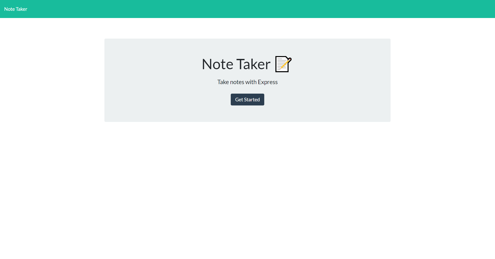
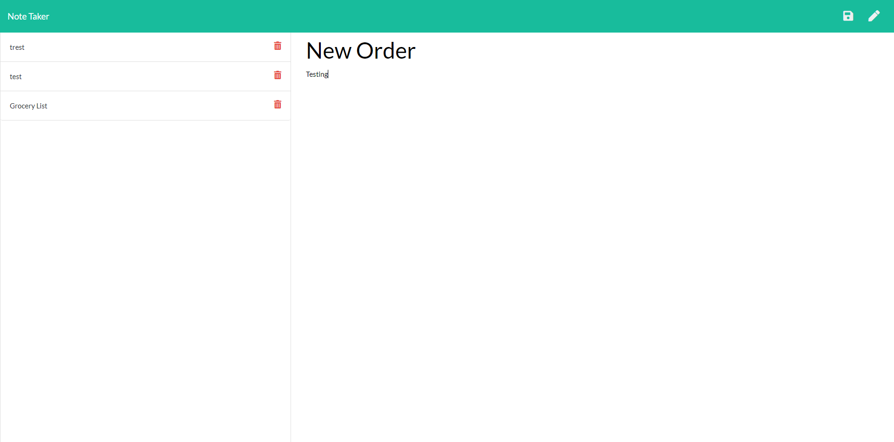

# Note-Taker

## Deployed Link
[Note Taker on Heroku!](https://safe-falls-60671.herokuapp.com//)

## Instructions

This is a note taking application using Express and Node.js. This application has functionality to add, view, and delete notes that are being stored in a db.json file.

This application requires the following NPM modules:

### fs
### Express
### Path

The initial page will take you to a welcome/start page, click on the "Get Started" button to begin the Note taking!!!

Once the notes page is displayed, you can begin entering a new note by clicking into the "Note Taker" field and adding a title and a body to your note. 

To save your new note to the "saved area", simply press the save icon. 

To create a new note, click on the pencil icon in the top right corner. You can view your saved notes at any time and to delete simply press the trash can icon next to the particular note.  

Selecting the Note taker link in the top left will bring you back to the Note-Taker Homepage.

## Resources

- https://expressjs.com/en/4x/api.html
- https://expressjs.com/en/guide/routing.html
- https://developer.mozilla.org/en-US/docs/Learn/Server-side/Express_Nodejs/Introduction

